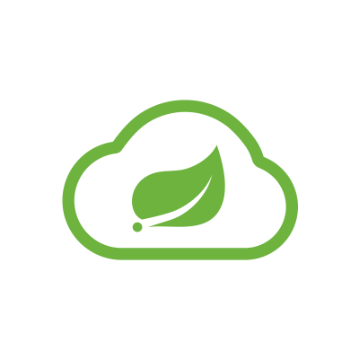

최근에 진행하고 있는 프로젝트에서 저희는 마이크로 서비스 아키텍처를 도입했습니다. 기술 스택 선정에 있어서 우선 가장 자주 사용되는 기술들과 Cloud Native 환경에 적합한 기술들을 선정하기 위해 노력했습니다.

### 프로젝트에서 사용중인 기술 Spec
> - K8s
> - istio (Service mesh, Ingress Gateway)
> - argoCD
> - Prometheus
> - jaeger
> - EFK

또한, 내부 service들은 Knative로 구성된 NodeJS 기반 알림 서버를 제외하고 Spring 기반의 WAS로 운영되고 있습니다. 내부 service들은 service mesh로 구성되어 있고, 외부의 트래픽은 gateway를 통해 내부 service들로 접근하게 됩니다.
간략히 그림으로 나타내면 다음과 같겠네요.

## Gateway 

일단, Gateway에 대해서 간략히 설명해보겠습니다. Gateway는 클라이언트와 서버 사이의 트래픽을 관리하고 요청을 적절한 서비스로 라우팅하는 역할을 합니다. 또한, 단일 진입점을 제공해 각 내부 서비스에서 공통으로 필요한 로직을 통합하여 처리할 수 있습니다. 인증/인가, 보안 정책, 유저 데이터 등을 처리한 뒤, 내부의 서비스로 라우팅해줍니다.

저희 프로젝트에서는 Spring Cloud Gateway를 API 게이트웨이로, Istio Ingress Gateway를 인그레스 게이트웨이로 활용하는 구조를 택했습니다.

실제 Kiali를 통해 볼 수 있는 저희 서비스의 gateway traffic 흐름은 다음과 같습니다.

## Istio Ingress Gateway 선택 이유

사실, 저희 서비스에서 실제로 L4 트래픽을 관리할 일은 많지 않지만 기본적인 정책들을 적용해보고 싶었기 때문에 가장 앞단에 Ingress Gateway를 배치하게 되었습니다. 일단, Istio는 마이크로서비스 아키텍처에서 강력한 네트워크 관리와 트래픽 제어 기능을 제공하는 서비스 메시 솔루션인데요. 특히 Istio Ingress Gateway는 클러스터 외부로부터 들어오는 요청을 처리하고, 이를 적절한 내부 서비스로 라우팅하는 기능을 담당합니다. 

저희 서비스에서의 Istio Ingress Gateway는 클러스터 외부에서 들어오는 트래픽을 수신하고, 이를 내부로 전달하기 전에 초기 네트워크 정책을 적용하고 보안 설정을 적용합니다. 이를 통해 외부 트래픽에 대한 인증/인가, TLS 암호화 등을 처리하고 있습니다.

## Spring Cloud Gateway 선택 이유

api-gateway와 연결된 서비스들이 Spring 기반의 WAS이기에 Spring 친화적으로 L7 트래픽에 대한 필터링과 라우팅을 제공하기 위해 선택했습니다. 다들 Spring Cloud Gateway에 대해서 잘 아실테니 설명은 따로 하지 않을게요.

저희는 실제로, spring cloud의 api-gateway를 auth-service와 연결하여, 인증/인가 작업을 수행하며 적절한 라우팅 규칙을 통해 트래픽을 업스트림 서버로 전달합니다. 또한, 다양한 공통 작업들이 단일 지점에서 수행되는데요.

1. 위에서 언급한 서비스에 대한 인증/인가
2. request에 대한 전/후처리
3. 다양한 공통 정보를 위한 필터링 로직 수행
4. 안정적인 L7 통신을 위한 설정
5. API 호출/응답 데이터 logging

이 수행되고 있습니다.

## 두 Gateway의 조합을 통한 이점

1. 보안강화 

Istio Ingress Gateway에서 외부 트래픽에 대한 초기 보안을 적용하고, Spring Cloud Gateway에서 추가적인 보안 로직을 처리함으로써 다중 보안 계층을 구축할 수 있습니다.

2. 유연한 트래픽 관리

Istio는 네트워크 레벨에서의 트래픽 제어를 담당하고, Spring Cloud Gateway는 애플리케이션 레벨에서의 세밀한 요청 처리를 담당하여 트래픽을 효율적으로 관리할 수 있습니다.

3. 모니터링 및 관찰성 향상

Istio의 분산 추적 기능과 Spring Cloud Gateway의 로깅 및 메트릭 수집 기능을 결합하여 클라이언트부터 내부 서비스까지의 트래픽 흐름을 종합적으로 모니터링할 수 있습니다.

저희는 두 gateway의 조합을 통해 다양한 이점을 얻을 수 있게 되었고, 서비스의 안정성 또한 확보할 수 있었습니다.

## 마지막으로

이점이 많아보이지만, 이것도 결국 trade-off가 존재하겠죠. 초기 설정에 많은 시간을 할애했습니다. 특히, 두 개의 gateway에서 cors 관련된 이슈가 정말 추적하기 어려웠고 k8s 환경 자체도 실무에서 완전 cloud native한 환경을 구축해본 경험이 없었기에 삽질을 많이 했던 것 같습니다. 또한, 트래픽이 엄청나게 많지 않은 이상 gateway도 하나로 충분할 수 있었고, MSA 까지 가지 않아도 충분했을 겁니다. 그럼에도, 실험적인 도전은 이런 프로젝트가 아닌 이상 하기 힘들거라 판단했고, 직접 삽질하며 인프라 설계, 자동화, 서비스 로직 구현까지 뚝딱 해내고 있는 스스로를 보면 나쁘지만은 않은 것 같습니다. 이런 오버 엔지니어링도 스스로가 인지하고 있고, 마감일을 놓칠정도로 문제가 생기지 않으면 한번쯤 도전해볼만한 것 같아요.

아래처럼 서비스가 안정적으로 동작하는 것만 봐도 뿌듯하네요.

