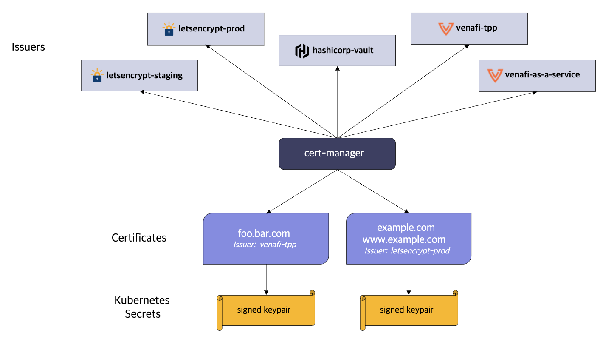

### Prerequisite :

본 글에서 언급되지만, 직접적인 설명은 하지 않는 것들입니다.

- kubernetes
- TLS
- istio

### 환경

저희 프로젝트는 이미 GKE 내에 istio 관련 설정이 기본적으로 셋팅되어 있습니다.

.gif>)

- GKE
- istio service mesh
- istio ingress gateway
- kiali

## 소개

서비스를 실제로 배포하고, 사용자들에게 더 안전한 서비스를 보장하기 위해 https 를 사용합니다.
저희 프로젝트의 end-point는 istio ingress gateway로 연결되어 있습니다. 그렇기에 TLS 설정을 istio ingress gateway에 적용해야 합니다.

## Cert Manager

cert-manager는 kubernetes 클러스터에서 TLS 인증서의 관리를 자동화해 주는 오픈소스입니다. 이를 통해 인증서의 발급, 갱신 그리고 배포 과정을 자동화하여 보안을 강화하고 운영의 편의성을 높일 수 있습니다.



cert manager는 다양한 CA와 연동할 수 있는데, 저희 서비스 설정에서는 Let`s Encrypt를 사용했습니다.

### 설정 과정

#### install cert-manager

<code> kubectl apply -f https://github.com/jetstack/cert-manager/releases/download/v1.1.0/cert-manager.yaml </code>

해당 명령어를 통해 cert-manager를 설치합니다.

저는 cert-manager-cainjector pod가 Kubernetes API 버전 호환성 문제로 인해 crash가 발생했는데, cert-manager의 버전을 v1.13.0 을 지정하여 설치했습니다.

#### ClusterIssuer 리소스 생성

```zsh
kkubectl apply -f - <<EOF
#prod
apiVersion: cert-manager.io/v1
kind: ClusterIssuer
metadata:
  name: letsencrypt-prod-istio
spec:
  acme:
    server: https://acme-v02.api.letsencrypt.org/directory
    email: your email
    privateKeySecretRef:
      name: letsencrypt-prod-istio
    solvers:
    - http01:
        ingress:
          class: istio
---
#staging
apiVersion: cert-manager.io/v1
kind: ClusterIssuer
metadata:
  name: letsencrypt-staging-istio
spec:
  acme:
    server: https://acme-staging-v02.api.letsencrypt.org/directory
    email: your email
    privateKeySecretRef:
      name: letsencrypt-staging-istio
    solvers:
    - http01:
        ingress:
          class: istio
EOF
clusterissuer.cert-manager.io/letsencrypt-prod-istio created
clusterissuer.cert-manager.io/letsencrypt-staging-istio created
```

이 설정은 cert-manager를 사용하여 Let`s Encrypt로부터 TLS 인증서를 발급하는 리소스를 생성합니다. 해당 설정을 통해 클러스터 내에서 자동으로 인증서를 발급받고 갱신할 수 있게 됩니다.

> 두 개의 ClusterIssuer 리소스 생성
>
> - letsencrypt-prod-istio: Let’s Encrypt의 프로덕션 환경을 사용하여 실제 서비스에서 신뢰할 수 있는 인증서를 발급받기 위한 ClusterIssuer입니다.
> - letsencrypt-staging-istio: Let’s Encrypt의 스테이징 환경을 사용하여 테스트 목적으로 인증서를 발급받기 위한 ClusterIssuer입니다. 이 환경에서 발급된 인증서는 브라우저에서 신뢰하지 않으며, 발급 제한 없이 테스트할 수 있습니다.

> 설정의 목적과 역할
>
> 1. Let’s Encrypt와의 연동을 위한 ClusterIssuer 생성
>    • cert-manager가 Let’s Encrypt를 통해 TLS 인증서를 발급받을 수 있도록 설정합니다.
>    • 두 개의 ClusterIssuer를 생성하여 테스트 환경과 실제 서비스 환경에서 모두 인증서를 발급받을 수 있습니다.
>
> 2. ACME 프로토콜을 통한 인증서 발급 자동화
>    • ACME(Automatic Certificate Management Environment) 프로토콜을 사용하여 도메인 소유권을 자동으로 검증하고 인증서를 발급받습니다.
>    • cert-manager는 ACME 프로토콜을 구현하여 Let’s Encrypt와 통신합니다.
>
> 3. Istio Ingress Gateway와의 통합
>    • ingress.class: istio 설정을 통해 HTTP-01 챌린지를 처리할 때 Istio Ingress Gateway를 사용하도록 지정합니다.
>    • 이를 통해 도메인 검증 요청이 Istio Ingress Gateway를 통해 cert-manager로 전달됩니다.

#### Certificate 리소스 생성

certificate.yaml 파일을 작성하여 원하는 도메인에 대한 TLS 인증서를 요청합니다.

1. certificate.yaml 파일 작성

```yaml
apiVersion: cert-manager.io/v1
kind: Certificate
metadata:
  name: istio-ingressgateway-certs
  namespace: istio-system
spec:
  secretName: istio-ingressgateway-certs
  issuerRef:
    name: letsencrypt-prod-istio # 이전에 생성한 ClusterIssuer 이름
    kind: ClusterIssuer
  commonName: your.domain.name # 실제 도메인 이름으로 변경
  dnsNames:
    - your.domain.name # 실제 도메인 이름으로 변경
```

2. certificate.yaml 파일 적용

<code> kubectl apply -f certificate.yaml </code>

이 명령어를 실행하여 Certificate 리소스를 클러스터에 적용합니다. cert-manager는 이 리소스를 감지하고, 지정된 ClusterIssuer를 통해 인증서를 발급받기 시작합니다.

#### 인증서 발급 상태 확인

<code> kubectl describe certificate istio-ingressgateway-certs -n istio-system </code>

위의 명령어를 입력하게 되면 아래와 같은 정보가 나오게 됩니다.

```zsh
Name:         istio-ingressgateway-certs
Namespace:    istio-system
Labels:       <none>
Annotations:  <none>
API Version:  cert-manager.io/v1
Kind:         Certificate
Metadata:
  Creation Timestamp:  2024-11-26T13:48:49Z
  Generation:          1
  Resource Version:    1367115
  UID:                 uuid
Spec:
  Common Name:  dns name
  Dns Names:
    dns name
  Issuer Ref:
    Kind:       ClusterIssuer
    Name:       letsencrypt-prod-istio
  Secret Name:  istio-ingressgateway-certs
Status:
  Conditions:
    Last Transition Time:  2024-11-26T14:08:12Z
    Message:               Certificate is up to date and has not expired
    Observed Generation:   1
    Reason:                Ready
    Status:                True
    Type:                  Ready
  Not After:               2025-02-24T13:09:40Z
  Not Before:              2024-11-26T13:09:41Z
  Renewal Time:            2025-01-25T13:09:40Z
  Revision:                1
Events:                    <none>
```

전체적인 의미로는

인증서 발급 상태

    •	Ready 상태이며, 인증서가 정상적으로 발급되어 사용 중임을 나타냅니다.
    •	Message에서 “Certificate is up to date and has not expired”라고 되어 있으므로, 인증서가 최신 상태입니다.

인증서의 유효 기간

    •	Not Before: 2024-11-26T13:09:41Z
    •	인증서의 유효 시작일입니다.
    •	Not After: 2025-02-24T13:09:40Z
    •	인증서의 만료일로, 약 3개월의 유효 기간을 가집니다. Let’s Encrypt 인증서는 일반적으로 90일의 유효 기간을 갖습니다.
    •	Renewal Time: 2025-01-25T13:09:40Z
    •	cert-manager는 이 시점 전에 인증서를 자동으로 갱신합니다. 일반적으로 만료일의 30일 전에 갱신을 시작합니다.

인증서의 발급자

    •	Issuer Ref에서 Kind가 ClusterIssuer이고 Name이 letsencrypt-prod-istio이므로, 이 인증서는 Let’s Encrypt 프로덕션 환경을 사용하여 발급되었습니다.

인증서의 대상 도메인

    •	Common Name과 DNS Names에 dns name이 설정되어 있습니다.
    •	이 인증서는 dns name 도메인에 대해 발급되었습니다.

인증서의 저장 위치

    •	발급된 인증서와 개인 키는 istio-ingressgateway-certs라는 이름의 Secret에 저장됩니다.
    •	이 Secret은 istio-system 네임스페이스에 존재하며, Istio Ingress Gateway에서 참조하여 TLS 통신에 사용됩니다.

## istio ingress gateway 설정

여기까지 왔다면, Kubernetes 클러스터 내에서 자동으로 TLS 인증서를 관리하는 설정까지 완료했습니다.

그 다음으로는 Istio Ingress Gateway에 인증서를 적용하고, HTTPS 설정을 진행해야 합니다. 이를 통해 외부에서 들어오는 트래픽에 대해 안전한 통신을 보장할 수 있습니다.

### 설정 과정

#### Istio Ingress Gateway에 인증서 적용

Istio Ingress Gateway가 발급된 TLS 인증서를 사용하도록 설정하려면, 인증서가 저장된 Secret을 Gateway에 마운트해야 합니다.

1.1 Istio Ingress Gateway 디플로이먼트 수정

먼저, Istio Ingress Gateway의 Deployment를 수정하여 인증서 Secret을 마운트합니다.

<code> kubectl edit deployment istio-ingressgateway -n istio-system </code>

위 명령어를 실행하면 기본 에디터에서 Deployment의 YAML 파일이 열립니다. 여기서 다음과 같이 수정합니다.

volumes 섹션 추가

```yaml
spec:
template:
spec:
volumes: - name: istio-ingressgateway-certs
secret:
secretName: istio-ingressgateway-certs
optional: true
```

volumeMounts 섹션 수정

containers 섹션 아래의 volumeMounts에 다음 내용을 추가합니다.

```yaml
containers:
  - name: istio-proxy # Istio Ingress Gateway의 컨테이너 이름입니다.
    volumeMounts:
      - mountPath: /etc/istio/ingressgateway-certs
        name: istio-ingressgateway-certs
        readOnly: true
```

전체 예시:

```yaml
apiVersion: apps/v1
kind: Deployment
metadata:
  name: istio-ingressgateway
  namespace: istio-system
spec:
  selector:
    matchLabels:
      app: istio-ingressgateway
  template:
    metadata:
      labels:
        app: istio-ingressgateway
    spec:
      volumes:
        - name: istio-ingressgateway-certs
          secret:
            secretName: istio-ingressgateway-certs
            optional: true
    containers:
      - name: istio-proxy
        volumeMounts:
          - mountPath: /etc/istio/ingressgateway-certs
            name: istio-ingressgateway-certs
            readOnly: true # 나머지 설정들은 기존 내용 유지
```

변경 사항을 저장하면 Kubernetes는 Deployment의 변경을 감지하고 Istio Ingress Gateway 파드를 재시작하여 새로운 설정을 적용합니다.

#### Istio Ingress Gateway 서비스의 포트 확인

Istio Ingress Gateway 서비스에서 HTTPS를 위한 포트가 올바르게 설정되어 있는지 확인합니다.

<code>kubectl get svc istio-ingressgateway -n istio-system</code>

출력 결과에서 PORT(S) 열에 443 포트가 포함되어 있어야 합니다.

예시:

```zsh
NAME TYPE CLUSTER-IP EXTERNAL-IP PORT(S) AGE
istio-ingressgateway LoadBalancer 10.100.200.1 34.123.45.67 15021/TCP,80/TCP,443/TCP,15443/TCP,15012/TCP,15017/TCP 2d
```

만약 443 포트가 없거나 다른 포트로 설정되어 있다면, 다음과 같이 서비스의 설정을 수정합니다.

<code>kubectl edit svc istio-ingressgateway -n istio-system</code>

ports 섹션에 다음 내용을 추가하거나 수정합니다.

ports:

```yaml
- name: https
  port: 443
  targetPort: 8443
  protocol: TCP
```

#### Gateway 및 VirtualService 설정

이제 Istio의 Gateway 및 VirtualService 리소스를 생성하여 Istio Ingress Gateway가 HTTPS 요청을 처리하고 적절한 서비스로 라우팅하도록 설정합니다.

Gateway 리소스 생성

gateway.yaml 파일을 생성하고 다음과 같이 작성합니다.

```yaml
apiVersion: networking.istio.io/v1beta1
kind: Gateway
metadata:
name: my-gateway
namespace: your-namespace # 실제 네임스페이스로 변경
spec:
selector:
istio: ingressgateway # Istio Ingress Gateway를 선택
servers:
  - port:
    number: 443
    name: https
    protocol: HTTPS
    tls:
    mode: SIMPLE
    credentialName: istio-ingressgateway-certs # Secret의 이름과 일치해야 함
    hosts:
      - "your.domain.com" # 실제 도메인 이름으로 변경
```

적용하기:

<code>kubectl apply -f gateway.yaml</code>

VirtualService 리소스 생성

virtualservice.yaml 파일을 생성하고 다음과 같이 작성합니다.

```yaml
apiVersion: networking.istio.io/v1beta1
kind: VirtualService
metadata:
name: my-virtualservice
namespace: your-namespace # 실제 네임스페이스로 변경
spec:
hosts:

- "your.domain.com" # 실제 도메인 이름으로 변경
  gateways:
- my-gateway
  http:
- match:
  - uri:
    prefix: "/" # 모든 요청 매칭
    route:
  - destination:
    host: your-service # 실제 서비스의 이름으로 변경
    port:
    number: 80 # 서비스의 포트 번호로 변경
```

적용하기:

<code>kubectl apply -f virtualservice.yaml</code>

## DNS 설정 확인 및 업데이트

도메인 이름이 Istio Ingress Gateway의 외부 IP 주소를 가리키도록 DNS 설정을 확인하고 필요하다면 업데이트합니다.

### 설정 과정

#### Istio Ingress Gateway의 외부 IP 확인

<code>kubectl get svc istio-ingressgateway -n istio-system</code>

출력 결과에서 EXTERNAL-IP 열에 표시된 IP 주소를 확인합니다.

#### DNS 레코드 업데이트

DNS 제공자의 관리 콘솔에서 해당 도메인의 A 레코드를 Istio Ingress Gateway의 외부 IP 주소로 설정합니다.

#### HTTPS 연결 테스트

설정이 완료되면 HTTPS 연결이 정상적으로 동작하는지 테스트합니다.

```zsh
curl -vk https://your.domain.com
```

## 마무리

이렇게해서 Istio Ingress Gateway에 TLS 인증서를 적용하고, HTTPS 설정을 진행해보았습니다. 이제 외부 클라이언트는 안전하게 HTTPS를 통해 서비스에 접근할 수 있습니다.

추가적으로, 내부 서비스 간 통신에 대해 mTLS를 적용하여 클러스터 내 보안을 강화할 수도 있습니다.

### 참고 자료

[Istio 공식 문서 - TLS 설정](https://istio.io/latest/docs/tasks/traffic-management/ingress/secure-ingress/)

[cert-manager 공식 문서](https://cert-manager.io/docs/)
