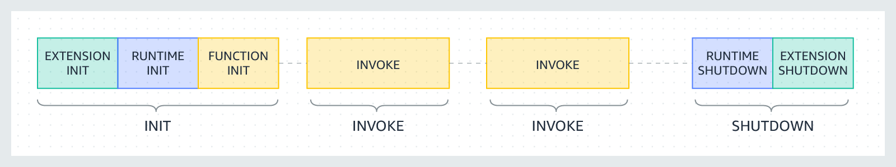

# AWS Lambda의 Execution Environment 이해하기

**AWS Lambda** 는 서버리스 컴퓨팅의 핵심 서비스로, 서버 관리 없이 코드를 실행할 수 있게 해줍니다. 이러한 편리함 뒤에는 **'Execution Environment(실행 환경)'** 라는 개념이 중요한 역할을 한다고 하는데요. 이번 글에서는 AWS Lambda의 Execution Environment가 무엇인지, 어떻게 동작하는지, 그리고 이를 최적화하여 활용하는 방법에 대해 알아보겠습니다.

## Execution Environment

Execution Environment는 Lambda 함수가 실행되는 격리된 환경으로, 함수 실행에 필요한 모든 리소스를 관리합니다. 각 Execution Environment는 다음과 같은 구성 요소를 포함합니다.

- **메모리(Memory)** : 함수에 할당된 메모리 용량으로, 함수 생성 시 설정함
- **CPU** : 할당된 메모리에 비례하여 CPU 성능이 결정됨
- **임시 스토리지(Ephemeral Storage)** : 함수 실행 중 `/tmp` 디렉터리를 통해 최대 512MB의 임시 스토리지를 제공함
- **타임아웃(Timeout)** : 함수의 최대 실행 시간을 설정하며, 기본값은 3초, 최대 15분까지 가능함
- **핸들러(Handler)** : 함수의 진입점으로, 이벤트를 처리하는 메인 메서드
- **프로비저닝된 동시성(Provisioned Concurrency)** : 함수의 초기화를 미리 수행하여 콜드 스타트 지연을 최소화하는 옵션
- **환경 변수(Environment Variables)** : 함수 실행 시 필요한 설정값들을 저장함

각 함수는 고유한 Execution Environment에서 실행되며, 함수 간에 이 환경이 공유되지 않습니다. 그러나 동일한 함수가 반복 호출될 경우, 동일한 Execution Environment가 재사용될 수 있습니다. 이러한 재사용 특성은 함수의 성능 최적화에 중요한 영향을 미칩니다.

## Execution Environment의 생명주기

Execution Environment는 함수 실행 시 다음과 같은 단계를 거칩니다.



1. **초기화 단계(Init)**

   - **Extension Init** : Lambda에 부가 기능을 추가하는 확장 프로그램을 초기화합니다.
   - **Runtime Init** : 선택한 언어의 런타임을 초기화하여 코드 실행을 준비합니다.
   - **Function Init** : 함수의 정적 코드를 실행하여 핸들러를 준비합니다.

   이 단계는 함수의 첫 호출 시 발생하며, 최대 10초의 지연이 생길 수 있습니다. 이러한 지연을 **'콜드 스타트(Cold Start)'**라고 합니다. **프로비저닝된 동시성**을 사용하면 이 지연을 최소화할 수 있습니다.

2. **호출 단계(Invoke)**
   실제 함수의 비즈니스 로직이 실행되는 단계로, 설정된 타임아웃 내에 완료되어야 합니다.

3. **종료 단계(Shutdown)**
   함수 실행이 완료되면 런타임과 확장 프로그램을 종료하고, Execution Environment를 정리합니다. 이 단계는 최대 2초가 주어지며, 이후 강제로 종료됩니다.

## Execution Environment의 재사용과 최적화

Lambda는 성능 최적화를 위해 종료 단계 이후에도 Execution Environment를 일정 시간 유지합니다. 이로 인해 다음과 같은 이점이 있는데요,

- **전역 변수의 유지**

핸들러 외부에서 초기화된 변수나 객체는 Execution Environment가 재사용될 때 그대로 유지됩니다. 이 환경이 유지되어 전역변수로 만들어진 객체들의 참조가 지속적으로 남아있는 것이죠. </br>

예를 들어, 데이터베이스 연결을 전역 변수로 선언하면 첫 호출 이후 재사용되어 성능이 향상됩니다.

```javascript
// 초기화 코드
let dbConnection

if (!dbConnection) {
  dbConnection = initializeDBConnection()
}

exports.handler = async event => {
  // dbConnection을 사용한 로직
}
```

- **임시 스토리지의 재사용**

<code>/tmp</code> 디렉터리에 저장된 파일은 Execution Environment가 유지되는 한 다음 호출 시에도 접근 가능합니다. 이를 활용하여 캐시나 임시 데이터를 저장할 수 있습니다.

- **백그라운드 프로세스의 지속**

함수 종료 시 완료되지 않은 백그라운드 작업이나 콜백 함수는 Execution Environment 재사용 시 다시 실행될 수 있는데요, NodeJS 기반에서 Promise가 다음 함수에서 resolve 되어버리는 문제가 발생할 수 있습니다.

## 최적화 사례

- **전역 변수 활용**

데이터베이스 연결이나 외부 API 클라이언트 등 재사용 가능한 객체는 전역 변수로 선언하여 초기화 비용을 절감

- **임시 스토리지 활용**

반복적으로 필요한 데이터는 <code>/tmp</code> 디렉터리에 저장하여 I/O 비용을 최소화

- **프로비저닝된 동시성 사용**

콜드 스타트 지연이 허용되지 않는 경우, 프로비저닝된 동시성을 설정하여 항상 준비된 Execution Environment를 유지시킬 수 있음

## 마무리

AWS Lambda의 Execution Environment는 함수의 성능과 효율성에 직접적인 영향을 미칩니다. 그 동작 원리와 생명주기를 깊이 이해하고 적절히 활용하면 서버리스 애플리케이션의 성능을 극대화할 수 있습니다. 앞으로 Lambda Extensions나 프로비저닝된 동시성 등 고급 주제에 대해서도 지속적으로 학습하여 더욱 최적화된 서버리스 아키텍처를 구축해보려고 합니다.

감사합니다.
