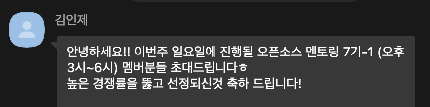
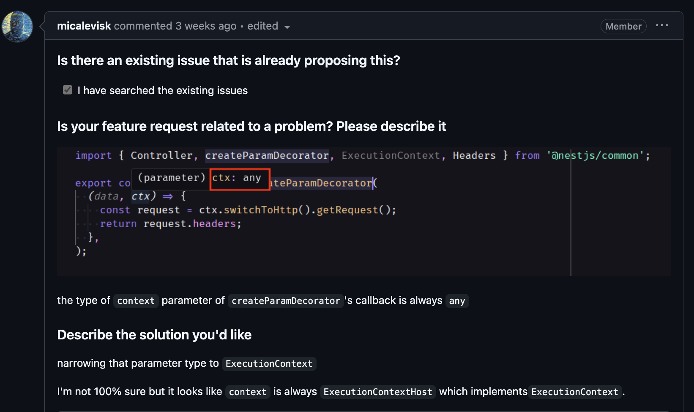
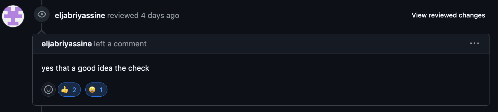
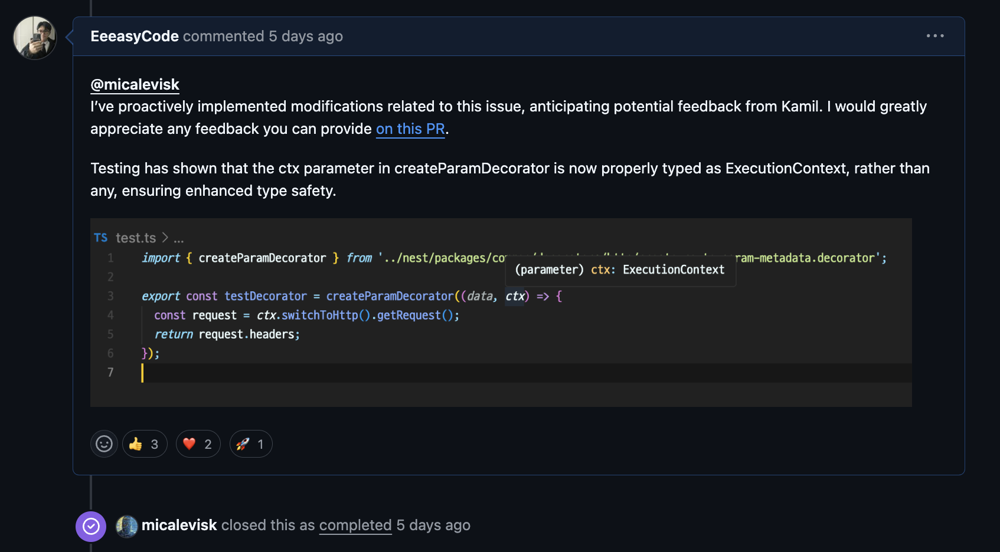

최근에 김인제 님께서 진행하시는 "오픈 소스 멘토링 7기" 활동을 진행했어요. 인제 님에 대한 소개는 [깃허브 링크](https://github.com/injae-kim)로 대신하겠습니다!

주변 지인의 추천으로 오픈 소스 멘토링을 소개받았었고, 지원자가 정말 많을 것이라는 이야기를 듣고 솔직히 멘토링에 선발될거라고 생각도 못했어요. 그런데 한 번에 되어버렸네요! ㅋㅋ

## 왜 오픈 소스를?

사실, 오픈 소스에 대한 관심은 이전부터 있었고, 올해 첫 TOSS/AOP 라이브러리에 한글 문서 번역 기여를 진행했었어요. 물론 문서 번역이라는 간단한 기여였지만 제가 올린 PR이 merge되었을 때 정말 뿌듯했었죠.

그럼 왜 오픈 소스 기여 활동을 하고 싶은 것이냐고 묻는다면, 아래의 내용으로 정리해볼 수 있을 것 같네요.

### 1. 내가 사용하는 라이브러리 혹은 프레임워크를 운영하시는 메인테이너 분들의 가치관을 가장 직관적으로 알 수 있다.

> 이게 무슨 말이냐면, 결국 기여하는 과정에서 메인테이너 분들의 리뷰를 받게 되어있는데 이 과정에서 그들이 어떠한 가치관을 갖고 해당 기술을 운영, 유지보수하는지 내 코드와 비교하며 대화를 나눌 수 있다는 것이죠.
>
> PR 뿐만 아니라 github에 올라온 Issue들을 잘 살펴보면, 메인테이너 분들이 의견을 공유해주시는데 이것도 그분들의 생각을 직관적으로 볼 수 있어요.
>
> 이를 통해서, "해당 기술은 어떠한 방향성으로 사용해야 하는구나" 와 같은 생각을 정리할 수 있었던 것 같아요. 그리고, PR이 merge가 되지 않거나, issue가 더 이상 논의되지 않아도 저는 충분히 가치가 있다고 생각해요. 그 과정에서 수많은 개발자들, 메인테이너들과 의견을 나누는 그 과정이 중요하다고 생각하거든요.

### 2. 내가 기여한 코드가 몇 년 후에는 수 억명의 개발자들이 사용하는 코드가 될 수 있다.

> 이건 오픈 소스 멘토링을 진행하며 인제님께서 말씀해주셨던 내용인데요. 제가 앞으로도 오픈 소스 기여 활동을 꾸준히 해야겠다는 의지를 갖게 해준 말이었어요.
>
> 내 작은 코드 하나가 전 세계 개발자들에게 도달해 큰 가치를 줄 수 있다는 것 자체만으로도 오픈 소스에 기여할 충분한 동기가 되는 것 같아요. 그게 문서화 작업이라도, 누군가는 그 문서를 보고 도움을 받을 수 있으니까요!

### 3. 개발 스킬 외에도 문서화, 테스트 코드, 커뮤니케이션 스킬을 키울 수 있다.

> 실제로 내 아이디어를 누군가에게 설명하고 납득시켜야 하는 과정이 필요해요. 내가 아무리 좋은 코드를 제안해도 (물론 너무 좋다면 approve가 되겠지만), 테스트 코드가 없어 검증하지 못하는 상황, 무슨 기능에 대한 내용인지에 대한 명확한 문서화가 없는 상황, 커뮤니케이션이 올바르게 되지 않아 지연되는 상황 등 기여에 대한 기회를 잃을 수 있는 문제들이 존재해요.
>
> 그래서, 좋은 코드를 작성하는 것도 중요하지만 내가 어떠한 문제를 파악했고, 이를 위한 개선점이 뭐가 존재하고 실제 구현 코드는 이렇다. 이에 대한, 검증은 이런 식으로 이루어졌다. 등 논리적으로 설명해 상대방을 납득시키는 것이 가장 중요한 점인 것 같아요.
>
> 또한, 대부분의 오픈 소스는 영어로 커뮤니케이션을 진행해야 하는데 내 생각을 영어로 정리해볼 수 있는 좋은 기회인 것 같아요. (저도 아직 번역기의 도움을 많이 받긴하지만) 글로벌 취업이 목표가 아니더라도 대부분의 공식 문서나 커뮤니티에서는 영어를 기본적으로 사용하기에 이런 스킬을 기르는 것도 강점이 될 것 같아요.

이런 장점들이 저를 오픈 소스라는 생태계로 빠지게 만들어 준 것 같아요. 제가 작성한 내용 말고도 오픈 소스 활동은 정말 많은 장점이 존재하니까 꼭 시작했으면 좋겠어요.

## 오픈 소스 멘토링?

Line 백엔드 개발자로, 다양한 오픈 소스 활동을 하고 계신 김인제님께서 진행하는 '[오픈 소스 멘토링](https://medium.com/@injae-kim)'의 7기 과정에 참여했어요. 멘토링은 인제님이 먼저 가이드라인을 제시해주고 저희는 따라가기만 하면 되는 활동으로 진행되었어요.

### 진행 과정

1. 진행하고 싶은 issue 선정
2. 선정한 issue에 대한 논의
3. issue에 대한 PR 올리기
4. 오픈소스 기부

멘토링은 위의 과정대로 진행되었어요. 사실, 진행하면서 내가 아무것도 기여하지 못하면 어떻게 하지? 라는 걱정이 앞섰는데요. 그 이유는 이슈 선정부터 아무것도 못하겠다는 생각이 들었기 때문이에요. ㅋㅋㅋ 하나같이 이슈들은 개발 천재들이 올린 것 같고, 그 안에서 이야기하는 분들도 뭔가 범접하기 힘든 아우라가 있었거든요. 그래서, issue의 다양한 label들을 활용해서 그 중 가장 쉬워보이는 issue들을 몇 개 선정했어요.

issue를 선정하고 나면, 인제님께서 각 issue에 대한 피드백을 꼼꼼하게 달아주시는데 정말 많은 참여자 분들의 이슈를 하나하나 작성해주시는 것보고 정말 너무 감사했습니다. 해당 피드백을 기반으로 내가 어떤 식으로 기여할지 가이드를 잡고, 멘토링이 있기 전까지 계속 그 issue들에 대해서 고민했어요.

멘토링 당일에 인제님과 멘티분들이 한 자리에 모여 간단한 소개를 시작으로 각자 선정한 issue를 한번씩 훑어보는데요. 정말 다양한 분야의 오픈 소스를 선정하고 하나도 겹치지 않는 것을 보고 신기했습니다. 하나쯤은 겹치는 이슈가 있을까 걱정했었거든요.

그렇게, issue에 대한 PR을 작성하면서 모르거나 막히는 부분이 있을 때, 인제님이 직접 피드백을 주시는데 이게 큰 도움이 되었던 것 같아요. 특정 기술에 대한 해결 방법보다, 어떤 식으로 오픈 소스에 접근하는지, 메인테이너 분들과 소통을 어떻게 해야하는지, 상대방을 설득하기 위해 어떤 식으로 PR을 작성해야 하는지 등 다양한 피드백을 주셨어요. (멘토링의 가장 큰 장점인 것 같았어요!)

그 결과, 저는 NestJS에 대한 PR 2개, Spring Cloud에 대한 PR 1개를 작성해 기여할 수 있었습니다!!! 그리고, 멘토링의 관례?라고 해야할까요? 내가 원하는 오픈소스에 기부하는 활동이 있었는데, 저는 제가 기여한 NestJS에 기부를 진행했어요. 뭔가 내가 코드로도 기여하고, 직접 기부도 하니까 더 잘됐으면 좋겠다는 생각이 들더라구요. 좋은 경험이었던 것 같아요.

## 마무리

### 멘토링에서 느낀 점

멘토링을 참가하면서 느낀 점은 크게 3가지로 정리할 수 있을 것 같아요.

### 1. 오픈 소스 기여에 대해 무서워하지 말자. (PR 올리고, issue 만드는 거 쫄지말 것)

> 처음에는 PR을 올릴지 말지, 인제님께 계속 물어봤어요. 이렇게 올려도 되는건가? 라는 걱정도 있었고, 누군가가 내 PR을 보고 좋지 않은 리뷰를 남기면 어떻게 하지? 라는 생각이 들었거든요. 근데 인제님꼐서 제가 올린 PR을 보고 이슈어나 메인테이너 분들은 좋아할 거라고, 걱정하지말고 PR 올려보라고 말씀해주셨어요. 사실, 어떻게보면 정답이 있는 것도 아니고 잘못된 부분이 있어도 그걸 굳이 비난할까? 싶더라구요. 그래서 PR을 올리고 issue를 만드는 것에 대해 걱정과 부담감을 내려놓고 마음껏 기여할 수 있게 된 계기가 된 것 같아요.

### 2. 인내심을 갖자.

> 메인테이너 분들도 똑같이 본업이 있고 오픈 소스 활동하는 일원이에요. 개인적으로 바쁠 수도 있고, 우선순위가 낮아질 수도 있는거죠. 또, 대부분 우리랑 시차가 맞지 않기떄문에 비동기 커뮤니케이션은 기본적인 것 같아요. 그래서 내가 올린 PR, issue에 그들의 반응이 늦어져도 그럴 수 있다는 생각을 갖고 하는 것이 중요한 것 같아요. 이 해답으로 하나의 issue말고 여러 개의 issue를 동시에 진행하는 것 ㅋㅋㅋ 이 있을 것 같아요!

### 3. 고민할 시간에 뭐라도 기여해보자.

> 이건 진짜 제가 계속 느낀 건데요. 아 이거 도전해볼까? 고민하는 찰나에 이미 다른 누군가가 기여해서 놓친 issue가 한두개가 아닌 것 같아요. 그냥 마음이 들었을 때, '내가 이 이슈에 대해서 기여해도 될까?' 혹은 PR을 만들어서 '내가 이 이슈에 대한 개선안을 코드로 구현해봤는데, 혹시 피드백 줄래?' 와 같이 바로 행동으로 옮기는 것이 속편해요. 거절당해도 좋은 경험이라 생각하면 되는 것이고, 피드백이 온다면 그것대로 또 얻는 것이 많으니까요.

그리고, 마지막으로 내가 사용중인 기술에 대해 더 깊은 이해와 애정을 갖게 되는 계기였어요. 모두 오픈 소스 활동을 하기를 바라고, 저처럼 이 활동이 두려우신 분들은 인제님의 오픈소스 멘토링 활동에 참여해보는 것을 추천드립니다!!

### 내가 기여한 것들

마지막으로 제가 멘토링 진행하면서 기여한 것들을 공유할게요! 긴 글 읽어주셔서 감사합니다! :)

### [NestJS] @nestjs/microservices should handle RabbitMQ bindings and auto-generated queues

- [진행 이슈 link](https://github.com/nestjs/nest/issues/13931)
- [PR link](https://github.com/nestjs/nest/pull/14129)
- [해결 과정](https://eeeasycode.dev/oss_project_03/)

> NestJS의 createParamDecorator의 callback 으로 전달되는 context의 type이 현재 any로 추론되는 것을 ExecutionContext Type으로 지정하여 사용자들이 NestJS의 Docs를 참고하지 않아도 createParamDecorator를 사용할 수 있게 하면 좋을 것 같다는 내용의 이슈
>
> → NestJS Common 에 존재하는 custom-route-param-metadata.decorator.ts 파일을 수정하여 context의 type을 ExecutionContext로 명시하여 type 안정성 및 type 추론을 할 수 있도록 기여함

### [NestJS] type narrowing context parameter on createParamDecorator's callback

- [진행 이슈 link](https://github.com/nestjs/nest/issues/14093)
- [PR link](https://github.com/nestjs/nest/pull/14126)
- [해결 과정](https://eeeasycode.dev/oss_project_02/)

> nestjs 에서 제공하는 microservices 에서 RabbitMQ 를 사용할 경우, RMQ의 binding 과 auto-generated queues 가 동작하지 않는 이슈

> → 1차 : 실제 원인 부분을 디버깅하여, 해당 문제에 대한 수정점을 코드로 제안하고 그 결과를 메인테이너 및 이슈어에게 제안함
>
> → 2차 : microservice의 RMQ 부분 로직에서 빠져있던, binding options을 추가하고 이를 queue에 binding 해주는 로직을 추가함. 또한, DEFAULT로 명시되던 queue name을 auto-generated 된 name으로 지정되도록 로직을 수정함. 이후, PR을 올려 메인테이너가 해당 이슈를 closed 한 뒤, 다음 마일스톤으로 할당함.

### [Spring Cloud Gateway] [online-docs][4.1.5] 404 from link to properties

- [진행 이슈 link](https://github.com/spring-cloud/spring-cloud-gateway/issues/3500)
- [PR link](https://github.com/spring-cloud/spring-cloud-gateway/pull/3588)

> Spring Cloud Docs의 잘못 명시된 link로 404 에러가 발생하는 이슈
>
> → 문제가 발생하는 부분 수정 후 PR 제안
