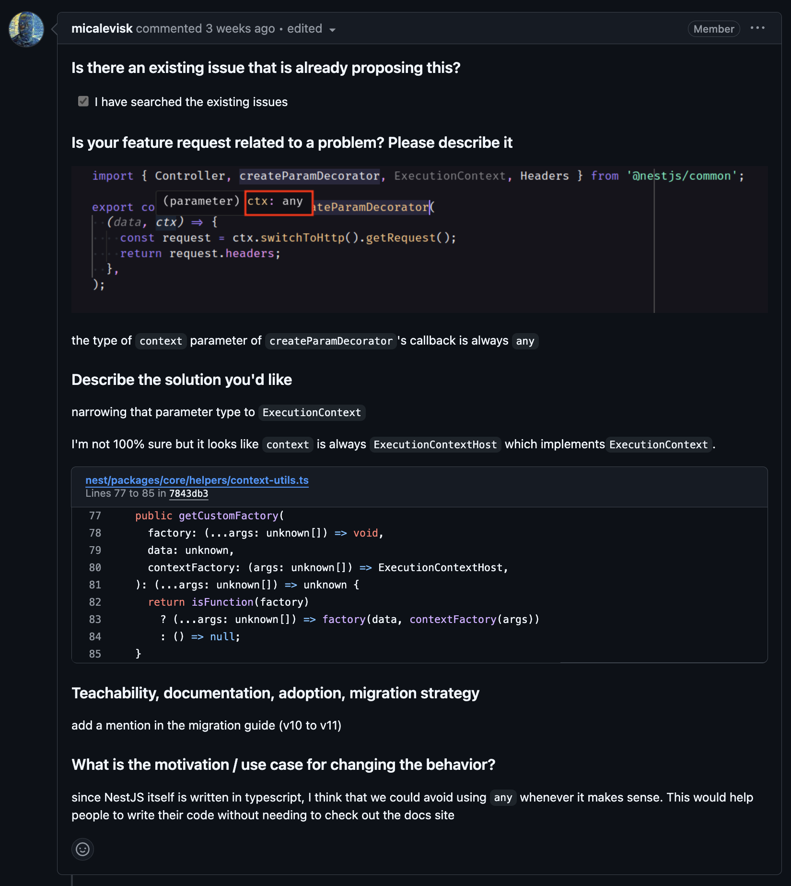

### [NestJS] type narrowing context parameter on createParamDecorator's callback

- [진행 이슈 link](https://github.com/nestjs/nest/issues/14093)
- [PR link](https://github.com/nestjs/nest/pull/14126)

## 이슈 내용



NestJS의 createParamDecorator의 callback 으로 전달되는 context의 type이 현재 any로 추론되는 것을 ExecutionContext Type으로 지정하여 사용자들이 NestJS의 Docs를 참고하지 않아도 createParamDecorator를 사용할 수 있게 하면 좋을 것 같다는 내용의 이슈

위의 사진에서 보이는 것처럼 현재 createParamDecorator의 parameter ctx type이 any로 지정되는 것을 볼 수 있다.

createParamDecorator의 context 매개변수 타입이 any로 설정되어 있어, 타입 체크가 이 context의 구조나 내용에 대해 알려주지 못한다. 실제로는 ExecutionContextHost 인스턴스가 context로 전달되며, 이 인스턴스는 ExecutionContext 인터페이스를 구현한다. 타입을 ExecutionContext로 변경하면 코드 작성 시 올바른 타입 추론을 제공할 수 있다.

## 해결 과정

네, 작성하신 해결 방안을 순차적으로 설명드리겠습니다. createParamDecorator 함수의 context 매개변수 타입을 any에서 ExecutionContext로 좁히는 방안을 적용한 과정입니다.

1. CustomParamFactory 인터페이스 수정

먼저 CustomParamFactory 인터페이스에서 context 타입을 ExecutionContext로 변경하여 더 명확하게 정의했습니다.

### 기존 코드

기존 CustomParamFactory의 타입 정의에서는 context 매개변수 타입이 명확하지 않았습니다.

```ts
export type CustomParamFactory<TData = any, TInput = any, TOutput = any> = (
  data: TData,
  input: TInput
) => TOutput
```

### 수정된 코드

context의 타입을 ExecutionContext로 지정하여, CustomParamFactory의 두 번째 매개변수가 ExecutionContext임을 명확히 하였습니다.

```ts
export type CustomParamFactory<TData = any, TOutput = any> = (
  data: TData,
  context: ExecutionContext
) => TOutput
```

이로 인해 CustomParamFactory를 사용하는 모든 곳에서 context가 ExecutionContext 타입을 가질 것임을 명확히 했습니다.

2. createParamDecorator 함수 매개변수 타입 변경

이제 createParamDecorator 함수에서 CustomParamFactory 인터페이스를 반영하여 context 매개변수를 ExecutionContext로 지정하였습니다.

### 기존 코드

기존 createParamDecorator의 factory 파라미터는 CustomParamFactory<FactoryData, FactoryInput, FactoryOutput>으로 정의되어 context의 타입이 명확하지 않았습니다.

```ts
export function createParamDecorator<
FactoryData = any,
FactoryInput = any,
FactoryOutput = any,

(
factory: CustomParamFactory<FactoryData, FactoryInput, FactoryOutput>,
enhancers: ParamDecoratorEnhancer[] = [],
): (
 ...dataOrPipes: (Type<PipeTransform> | PipeTransform | FactoryData)[]
) => ParameterDecorator {
// function body
}
```

### 수정된 코드

CustomParamFactory 인터페이스를 수정하여 ExecutionContext 타입을 반영함으로써 createParamDecorator의 factory 매개변수도 ExecutionContext 타입을 받게 되었습니다.

```ts
export function createParamDecorator<
FactoryData = any,
FactoryOutput = any,
(
factory: CustomParamFactory<FactoryData, FactoryOutput>,
enhancers: ParamDecoratorEnhancer[] = [],
): (
...dataOrPipes: (Type<PipeTransform> | PipeTransform | FactoryData)[]
) => ParameterDecorator {
// function body
}
```

이를 통해 createParamDecorator가 ExecutionContext 타입의 context를 처리할 수 있도록 개선했습니다. 또한, context가 항상 ExecutionContext임을 보장할 수 있으며, 타입 안전성을 더욱 높였습니다.

## 결과

NestJS Common 에 존재하는 custom-route-param-metadata.decorator.ts 파일을 수정하여 context의 type을 ExecutionContext로 명시하여 type 안정성 및 type 추론을 할 수 있도록 기여했습니다.

또한, ExecutionContext 타입을 더욱 명확히 하여 코드의 타입 안정성을 강화하고, 개발자가 NestJS의 문서를 참조하지 않아도 직관적인 코딩을 할 수 있게 개선했습니다.


