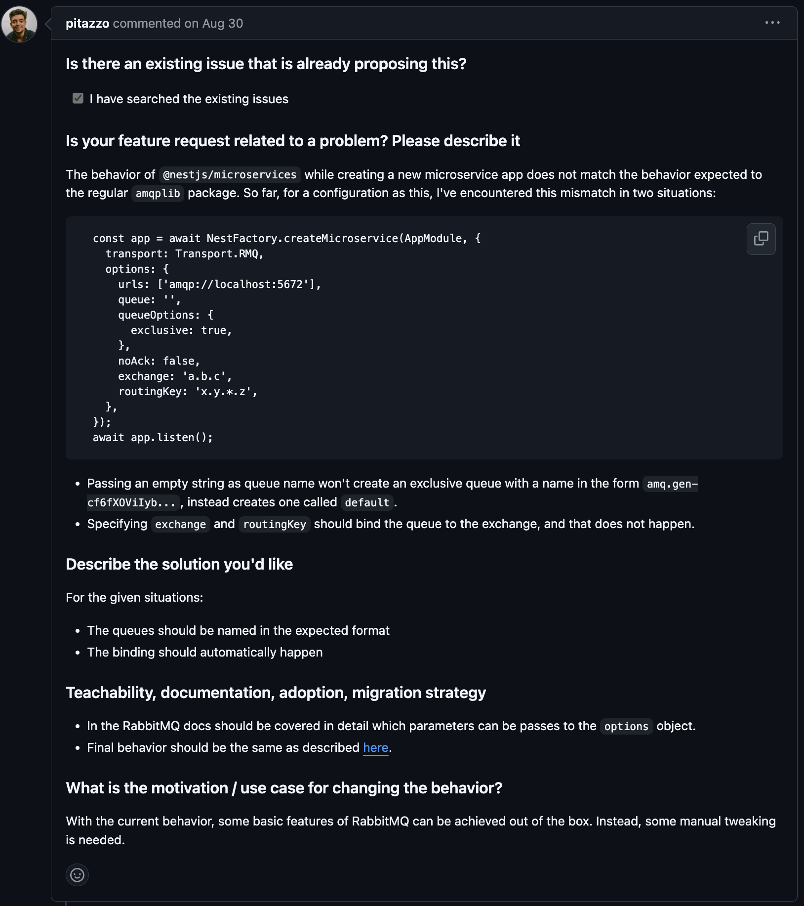
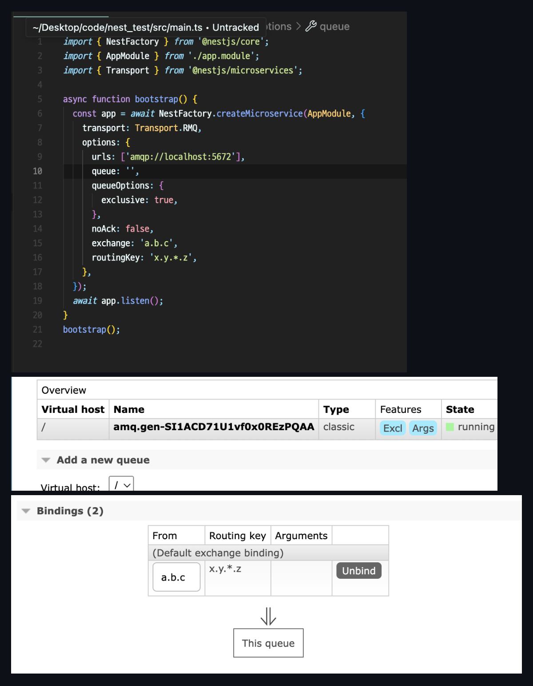

### [NestJS] @nestjs/microservices should handle RabbitMQ bindings and auto-generated queues

- [진행 이슈 link](https://github.com/nestjs/nest/issues/13931)
- [PR link](https://github.com/nestjs/nest/pull/14129)

## 이슈 내용

nestjs 에서 제공하는 microservices 에서 RabbitMQ 를 사용할 경우, RMQ의 binding 과 auto-generated queues 가 동작하지 않는 이슈



## 해결 과정

우선 제안한 해결 방안에 대한 가이드는 두 개로 다음과 같았습니다.

1. The queues should be named in the expected format

=> queue들은 예상된 형태로 이름이 부여되어야 함

### 디버깅 포인트

> queue의 이름이 ''로 지정될 때, RabbitMQ 의 옵션처럼 'amq.gen-asdnfks...' 형태가 아닌 'default'로 부여되는지를 파악

우선 packages/microservices/constants.ts 에서 RQM_DEFAULT_QUEUE이 default로 지정되어 있었습니다. 그리고 queue 옵션이 ''로 넘어오면, queue에 RQM_DEFAULT_QUEUE이 할당되어 실제 queue name은 default로 할당되는 문제가 발생했습니다.

단순히, packages/microservices/constants.ts 의 <code>export const RQM_DEFAULT_QUEUE = 'default';</code> 를 <code>export const RQM_DEFAULT_QUEUE = '';</code> 로 수정하니, 문제가 해결되었습니다.

2. The binding should automatically happen

=> binding은 자동적으로 진행되어야 함

### 디버깅 포인트

> binding 에 관련된 option들을 파악

우선 binding 옵션은 exchange와 routingKey 인데, 실제 NestJS microservices의 rabbitMQ option에는 해당 값들이 존재하지 않았습니다. 그래서, RMQOption interface에 해당 값들을 optional로 추가해주었습니다.

AS-IS

```ts
 isGlobalPrefetchCount?: boolean;
    queueOptions?: AmqplibQueueOptions;
    socketOptions?: AmqpConnectionManagerSocketOptions;
    noAck?: boolean;
    consumerTag?: string;
    serializer?: Serializer;
```

TO-BE

```ts
 isGlobalPrefetchCount?: boolean;
    queueOptions?: AmqplibQueueOptions;
    socketOptions?: AmqpConnectionManagerSocketOptions;
    // 해당 binding option을 optional로 추가
    exchange?: string;
    routingKey?: string;
    noAck?: boolean;
    consumerTag?: string;
    serializer?: Serializer;
```

그 다음, 사용자가 지정한 binding option이 실제로 server에 적용되는 조건문이 존재하지 않았습니다. 그래서, client-rmq.ts 와 server-rmq.ts 에 해당 설정을 binding 해주는 로직을 추가했습니다.

client-rmq.ts

```ts
if (!this.noAssert) {
  await channel.assertQueue(this.queue, this.queueOptions)
}

// 기존에 존재하지 않았던 로직
if (this.options.exchange && this.options.routingKey) {
  await channel.bindQueue(
    this.queue,
    this.options.exchange,
    this.options.routingKey
  )
}

await channel.prefetch(prefetchCount, isGlobalPrefetchCount)
await this.consumeChannel(channel)
resolve()
```

server-rmq.ts

```ts
 if (!this.noAssert) {
      await channel.assertQueue(this.queue, this.queueOptions);
    }

// 기존에 존재하지 않았던 로직
if (this.options.exchange && this.options.routingKey) {
    await channel.assertExchange(this.options.exchange, 'topic', {
    durable: true,
    });
    await channel.bindQueue(
    this.queue,
    this.options.exchange,
    this.options.routingKey,
    );
}

await channel.prefetch(this.prefetchCount, this.isGlobalPrefetchCount);
channel.consume(
    this.queue,
```

## 결과

그 결과로 실제 local에서 RabbitMQ와 nestjs microservice 설정을 진행해보았는데, 제기되었던 이슈의 문제를 말끔하게 해결할 수 있게 되었습니다.



queue를 ''으로 설정했을 때, Name이 'default'가 아닌 'amq.gen-...'으로 지정되었고, Binding의 option 또한 내가 지정한대로 잘 적용된 것을 확인할 수 있습니다.

아직, merge되진 않았지만 다른 분께서 좋은 제안인 것 같다는 코멘트와 메인테이너 분께서 해당 이슈를 completed로 변경하신 뒤 milestone을 적용해주신 것으로 보아, 다음 milestone까지 해당 PR에서 추가 피드백이나 논의가 진행될 것으로 예상됩니다.
