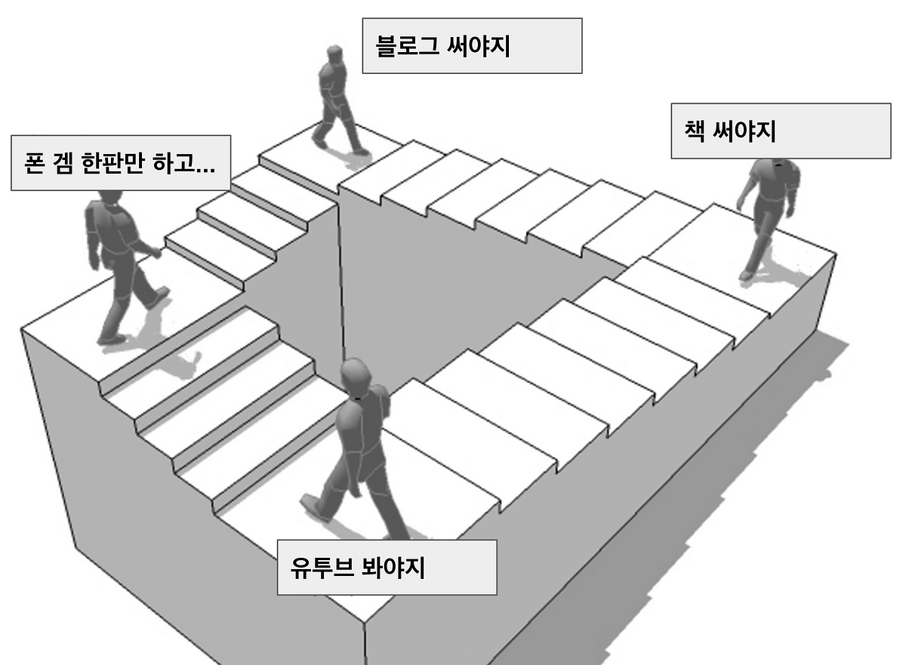

살면서 회고를 많이 해보지 않았던 것 같다. 회사에서 월마다 했던 개발자로서의 회고말고 학습에 대한 회고는 특히 처음이다.  
YAPP 활동을 하면서 KPT 회고 채널에 기웃거린 적이 있어, KPT 회고에 대해서는 어느정도 알고 있었고, 지식 공유자 "우빈"님께서 추천한 템플릿에 때마침 KPT 회고가 있어 적용해보려 한다.

## Keep (유지하고 싶은 점)

### 객체 지향 설계 원칙 학습의 중요성 
강의에서 배운 SOLID 원칙과 객체 설계에 대한 이해가 프로젝트에서 큰 도움이 되었다. 특히, **SRP(단일 책임 원칙)**을 적용하여 클래스나 메서드를 단일 책임으로 분리하고, **OCP(개방-폐쇄 원칙)**에 따라 기존 코드를 수정하지 않고 확장할 수 있는 구조를 직접 설계해보며 학습.

### 효율적인 시간 관리와 우선순위 설정
졸업 프로젝트와 커뮤니티 활동을 병행하면서 효율적으로 시간을 분배한 덕분에 여러 활동을 동시에 진행할 수 있었다. 우선순위를 잘 설정하고, 중요한 작업에 집중하는 습관이 업무를 원활하게 마무리하는 데 큰 도움이 되었다.

### 코드 가독성 향상
강의에서 배운 내용을 통해 코드 가독성에 큰 개선을 이루었습니다. 메서드와 클래스의 추상화 레벨을 조정하여 복잡한 로직을 단순화하고, 이름 짓기 원칙을 준수하여 코드의 의미 전달력을 높이려고 노력했다.

### 실제 프로젝트에 적용 
강의 내용을 기반으로 실제 진행 중인 프로젝트에 적용해가며 이해하려고 노력하고 있다. 보다 더 생각을 많이하고 코드를 짜게 되는 것 같다.

## Problem (아쉬웠던 점)

### 프로젝트 제출 기한 관리 부족
바쁜 스케줄로 인해 Day04 미션을 제출하지 못한 것이 너무 아쉽다. 여러 프로젝트와 커뮤니티 활동을 병행하는 과정에서 시간 관리가 어려웠고, 이를 통해 미션을 놓치게 된 점은 아쉬운 부분으로 남는다. 사실, 최고의 효율을 낼 수 있는 우선순위 설정을 했지만... 못한 부분이 있어 아숩다..

### 시간 압박으로 인한 학습 부족
프로젝트와 업무를 병행하다 보니, 일부 강의에서 다뤘던 디테일한 내용들을 직접 생각해보는 시간이 부족했다.

## Try (다음 프로젝트에서 시도할 점)
### 시간 관리 툴 도입
프로젝트 제출 기한 관리를 위해 **타임 블로킹(Time Blocking)**이나 프로젝트 관리 툴(예: Notion, Trello)을 적극적으로 도입해볼 예정이다. 이러한 도구를 통해 일정과 우선순위를 보다 명확하게 관리하고, 놓치는 일이 없도록 해보자.

### 이해한 내용들을 다시 글로 작성해보기
조금 더 배운 내용들을 잘 정제해서 블로그 글로 포스팅해보려고 한다. 미션도 미션이지만, 나의 학습으로 완전한 지식으로 만들고자 한다.